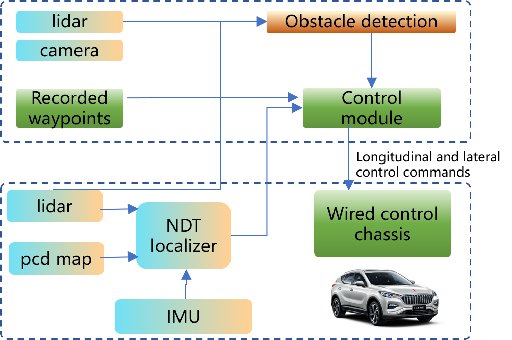

<h1>A simple autonomous path tracking framework based on LiDAR localization</h1>

## ✅Abstract

This project introduce a really simple autonomous path tracking framework which use LIDAR for localiztion. In this project, we use a wired modified HONGQI EHS3 as the platform. So, for reproducing this project, you need to prepare some items as following:

- LIDAR with at least 16 lines
- A computation device with ubuntu 18.04 or 20.04
- USB-CAN transfer device
- IMU with linear acceleration, angular velocity and orientation informations
- Carmera with object detection func(optional)
- A wired vechice (CAN communication)

## 🚗Overview

The workflow is showing below

## 🚀Currently Supported Features

- [x] Source code of modules
- [x] Guideline of whole process
- [ ] Guideline of chassis module(coming soon)
- [ ] Guideline of control module(coming soon)
- [ ] Simulink interface(coming soon)
- [ ] Autoware interface(coming soon)

## 📃Modules Description

`chassis_driver_ws` contains the source code of transferring CAN msg to ROS msg.

`lidar_driver_ws` contains the source code of modified leishen LIDAR ROS msg driver, you can switch to your own LIDAR topic.

`pointcloud2laserscan` is a modified [rospackage](https://github.com/ros-perception/pointcloud_to_laserscan) of transferring 3D pointcloud to 2D laserscan.

`PP_node` contains a pure pursuit algorithm and the path recording tool.

`AEB_node` generates deceleration command based on laserscan msg.

`hdl` is a modified [hdl localizer]([koide3/hdl_graph_slam: 3D LIDAR-based Graph SLAM](https://github.com/koide3/hdl_graph_slam)) using lidar and imu for localization.

`GUI.py` is the GUI interface which could generate start command.

`main.py `the main file assemble all function node together.

## 👓Getting Started

1. Install ROS1 environment
2. Compile all modules
3. Run chassis driver
4. Run lidar driver
5. Run localization module
6. Run pointcloud2laserscan module
7. Run control module
8. Run main function
9. Run GUI interface

## 📽️Some Videos

video1:

video2:  which introduce the process of lidar AEB function

video3:

If you like this project, give a star or subscribe my Bilibili channel😘😘😘

